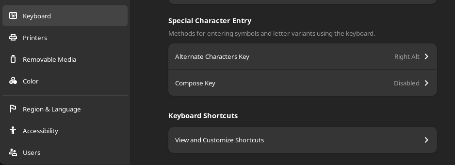
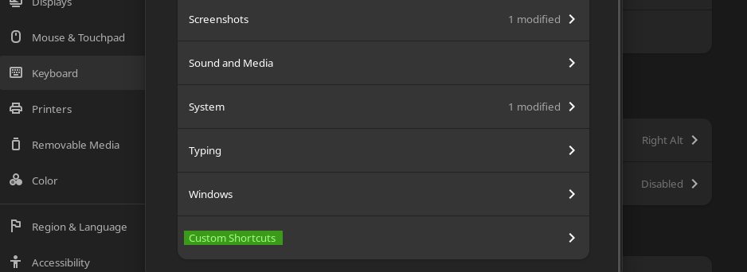
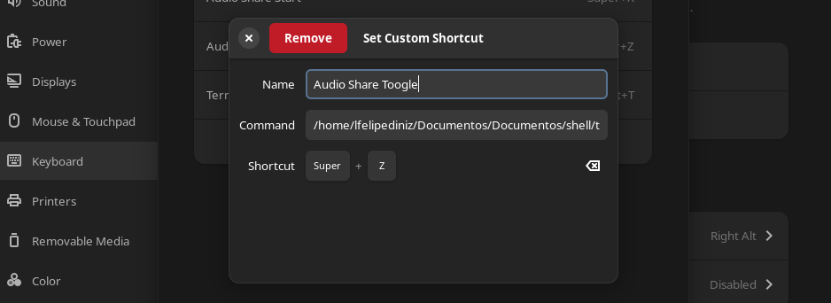
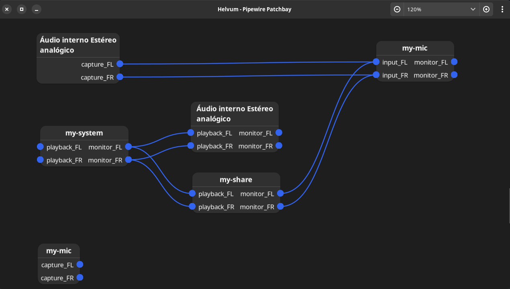
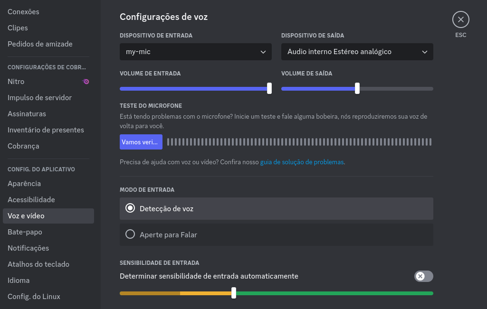

# AudioShare

Welcome to the AudioShare repository, a streamlined solution for sharing computer audio over a microphone. This versatile tool works across all Linux distributions, enabling users to transmit any computer audio during calls on platforms like Discord, Telegram, and more. The following instructions predominantly use Fedora (for users with pure PipeWire) and Manjaro (for those using pipewire-pulse).

## Important Note
While this guide is based on Fedora and Manjaro for ease of explanation, **the principles should apply to any Linux distribution**. Furthermore, it is important to highlight that over the years it is natural for most distributions to start migrating to pure PipeWire, as it is a more modern solution than PulseAudio.

## Features

- Simple and direct system audio sharing.
- Creation of a virtual microphone, usable across various conferencing applications.
- Individual volume control for audio sharing.
- High compatibility with different Linux distributions.
  

## Getting Started

### Requirements

- [PipeWire](https://pipewire.org/) or [pipewire-pulse](https://archlinux.org/packages/extra/x86_64/pipewire-pulse/)
- [Helvum](https://flathub.org/apps/org.pipewire.Helvum)
- Basic knowledge of command-line interface

### Installation

1. Clone the repository

    ```bash
    git clone https://github.com/yesmanic/AudioShare.git
    ```

2. Navigate to the project directory

    ```bash
    cd AudioShare
    ```
###  Check your Server Stream

To begin, determine whether your system uses PipeWire or PulseAudio in compatibility mode with pipewire-pulse. You can use the following commands to check your audio manager. The command that does not return an error, such as "unknown module," indicates your current server stream of audio manager.

For **PulseAudio**:
```bash
systemctl --user status pulseaudio
```

For **PipeWire**:
```bash
systemctl --user status pipewire
```

### Environment Setup

Once you have identified your server, proceed according to the corresponding instructions provided below:

<details>
    <summary markdown="span"><strong>PipeWire</strong></summary>
    <br>

Alright, the first thing we should do is run this command inside the AudioShare folder:

```bash
cd pipewire
```

Soon after, we need to give `.sh` execution permission as administrator:

```bash
sudo chmod +x audioShare.sh 
```

Now that we have given permission, we need to find out what the name of your sound card driver is to insert it into the script, to do this run:

```bash
sudo pw-link -iol
```

In my case, mine is called `alsa_output.pci-0000_00_1f.3.analog-stereo`, of course **it's probably not the same**, so look for one with a similar syntax if you have difficulty.


<br>

Now you have to edit the `audioShare.sh` file, here I will use nano for this:

```bash
sudo nano audioShare.sh
```
and insert the name of the sound card driver into the variable `sound_driver_name`, like this

```bash
sound_driver_name="here"
```
After running the script, review the changes you made. If everything matches what is described in the 'Usage' section, you have finished successfully.

```bash
./audioShare
```

Once you have run the script, review the changes it has made. If everything matches what is described in the 'Usage' section.
</details>

<details>
<summary markdown="span"><strong>Pipewire-Pulse</strong></summary>
</br>

We assume that you already Pipewire-Pulse installed on your system. If not, you can install it by `manjaro-pipewire` on Manjaro.

First, enter the `pipewire-pulse` folder:

```bash
cd pipewire-pulse
```
Soon after, we need to give `.sh` execution permission as administrator:

```bash
sudo chmod +x audioShare.sh
```
Now that we have given permission, we need to find out what the name of your sound card driver is to insert it into the script, to do this run:

```bash
sudo pactl list sources | grep node.name
```

You will see a list of sound card drivers, you need to find the one that starts with `alsa_input` and `alsa_output`. In my case, it is `alsa_input.pci-0000_00_1f.3.analog-stereo` and `alsa_output.pci-0000_00_1f.3.analog-stereo`, respectively. Of course, **it's probably not the same**, so look for one with a similar syntax if you have difficulty.

Now you have to edit the `audioShare.sh` file, putting the name of the sound card driver in the variables `sound_driver_output_name` and `sound_driver_input_name`, like this:

```bash
sound_driver_output_name="alsa_output.pci-0000_00_1f.3.analog-stereo"
sound_driver_input_name="alsa_input.pci-0000_00_1f.3.analog-stereo"
```

After running the script, review the changes you made. If everything matches what is described in the 'Usage' section, you have finished successfully.

```bash
./audioShare.sh
```
</details>

### Configuring Audio Toggle

For setting up an audio toggle to easily switch between standard audio and shared microphone audio.

We need to give `.sh` execution permission as administrator:
```bash
sudo chmod +x toggleAudioShare.sh
```

To make your life easier, it's quite helpful to set a keyboard shortcut to mute and unmute `my-share`, executing our script each time it's triggered. I will demonstrate using GNOME. Open settings and go to the Keyboard section:



go to Keyboard Shortcuts and click View and Customize Shorcuts:



Here is how I did it, pay attention, in Command you must place the location of your `toggleAudioShare.sh` file:



To find out the file directory, just use the `pwd` command in the terminal, when you find out, write in Command:

```bash
*location*/toggleAudioShare.sh
```

## Final Result

After setting up your `.sh` scripts successfully, they can be used as you feel comfortable. We recommend configuring them to start with the system. If execution is incomplete, likely due to `sleep` commands in the **bash scripts**, you may need to adjust the sleep durations based on your computer's boot speed.

Once the scripts are executed, open Helvum. The application should appear as described in this image:



If everything is OK, **Congratulations 🎉** You have configured audio sharing on your system!

## Usage

When you're on a call, you should use the virtual microphone 'my-mic' as the input device, and you can choose any preferred output device. In this instance, I am using my headphones. See the example on the Discord:



## Conclusion

The flexibility Linux offers has turned what once seemed like a limiting factor into a functional and straightforward feature. AudioShare exemplifies how we can leverage Linux's capabilities to enhance our digital interaction experiences.
